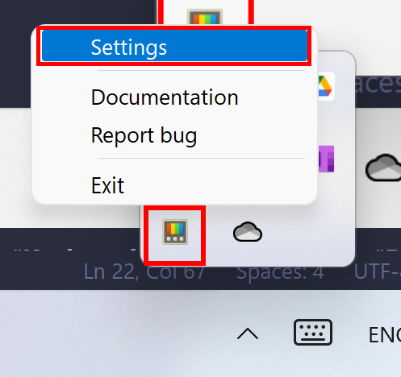

# **My shortcuts setup**
This repository shows my shortcuts setup to get more productivity.

### **Go to**
- [Version Record](./version-record.json)

### **OS support**
- Windows 10, 11
- Linux
- Mac

### **Packages requirement**
- [Brew](https://github.com/chinhchin/Brew-setup.git)
- [Fish Shell](https://github.com/chinhchin/Fish-Shell-setup.git)

### **Contents**

---

## **1. Windows**
### **1.1 Sharpkey**
1. Download and install [Sharpkey](https://www.randyrants.com/sharpkeys394.msi).
2. Set setting to this.

### **1.2 Powertoy keyboard**
1. Download and install [Microsoft PowerToys](https://apps.microsoft.com/store/detail/microsoft-powertoys/XP89DCGQ3K6VLD).
2. Open powertoy by press "**Window**" logo key and type "*PowerToys*", press "**Enter**" and then click at power toy logo at taskbar 
3. At "**Keyboard Manager**" pane, set "**Remap a shortcut**" to this 
