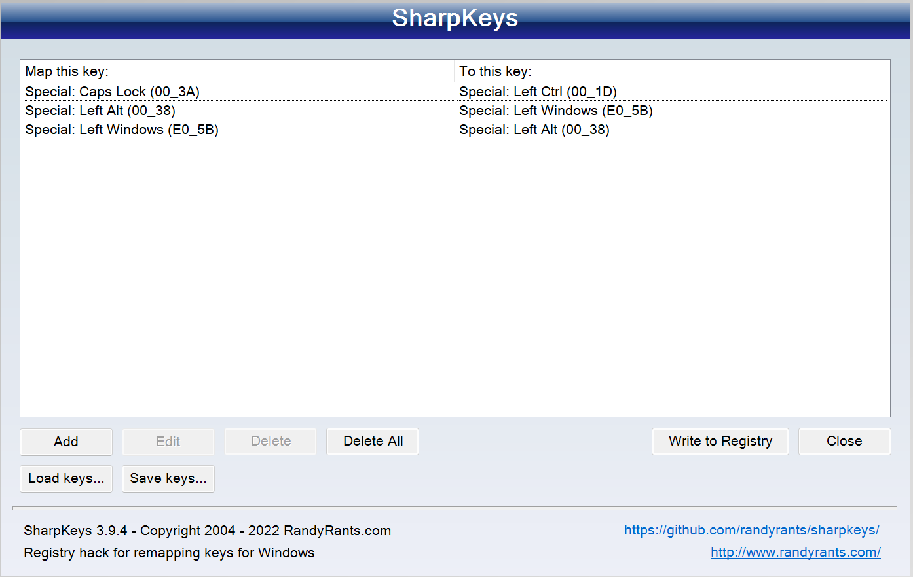
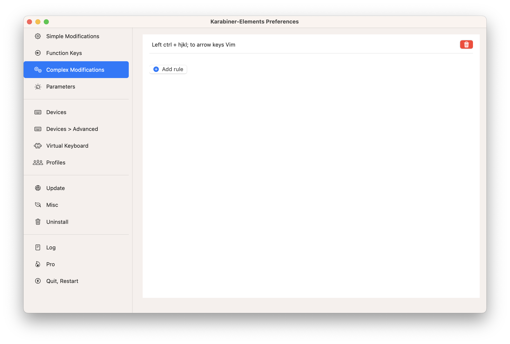

# **My keys remapping setup**
This repository shows my key remapping setup to get more productivity.

### **Go to**
- [Versions Recording](./versions.json)

### **OS support**
- Windows
- macOS

### **Contents**
#### [My key remapping and usage](./readme.md#1-my-key-remapping-and-usage)
1. [Keys reamapping](./readme.md#11-keys-remmapping)
2. [Usage](./readme.md#12-usage)

#### [Windows keys remapping setup](./readme.md#2-windows-keys-remapping-setup)
1. [Sharpkey](./readme.md#1-sharpkey)
2. [PowerToys keyboard manager](./readme.md#2-powertoys-keyboard-manager)

#### [macOS keys remapping setup](./readme.md#macos-keys-remapping-setup)
1. [Download and install Karabiner-Element](./readme.md#1-download-and-install-karabiner-elementshttpskarabiner-elementspqrsorg)
2. [Conig Karabiner Element](./readme.md#2-config-karabiner-element)

---

## **My key remapping and usage**
### **1. Keys remmapping**
- Map **\<Caps Lock\>** to **\<Left Ctrl\>**
- Map **\<Ctrl - h\>** to **\<Left\>**
- Map **\<Ctrl - j\>** to **\<Down\>**
- Map **\<Ctrl - k\>** to **\<Up\>**
- Map **\<Ctrl - l\>** to **\<Right\>**

### **2. Usage**
1. To reduce the distance ctrl is pressed in if the hand is placed on the keyboard.
2. To be able to move the cursor without leaving if the hand is placed on the keyboard


## **Windows keys remapping setup**
### **1. Sharpkey**
1. Download and install [Sharpkey](https://www.randyrants.com/sharpkeys394.msi).
2. Set setting to this.


### **2. PowerToys keyboard manager**
1. Download and install [Microsoft PowerToys](https://apps.microsoft.com/store/detail/microsoft-powertoys/XP89DCGQ3K6VLD).
2. Open powertoy by press "**Window**" logo key and type "*PowerToys*", press "**Enter**" and then click at power toy logo at taskbar 
3. At "**Keyboard Manager**" pane, set "**Remap a shortcut**" to this 

## **macOS keys remapping setup**
### **1. Download and install [Karabiner-Elements](https://karabiner-elements.pqrs.org)**

### **2. Config Karabiner-Element**
1. At "**Simple modifications**" pane, press "*Add item*" button, set "**From key**" to "*caps_lock*" and set "**To key**" to "*left_control*"

2. Add complex modification to assets by move "**complex_modifications**" folder to your "**~/Downloads**" directory and type this command to your terminal
```
cp ~/Downloads/complex_modifications/* ~/.config/karabiner/assets/complex_modification/
```
3. At "**Complex modifications**" pane, press "**Add rule**" button press "**Enable**" button at "*Left ctrl + hjkl to arrow keys Vim*" and "*change left_control+; to escape*".

